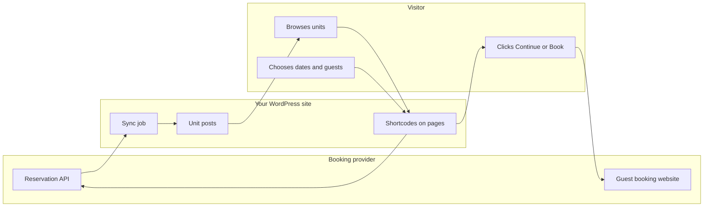
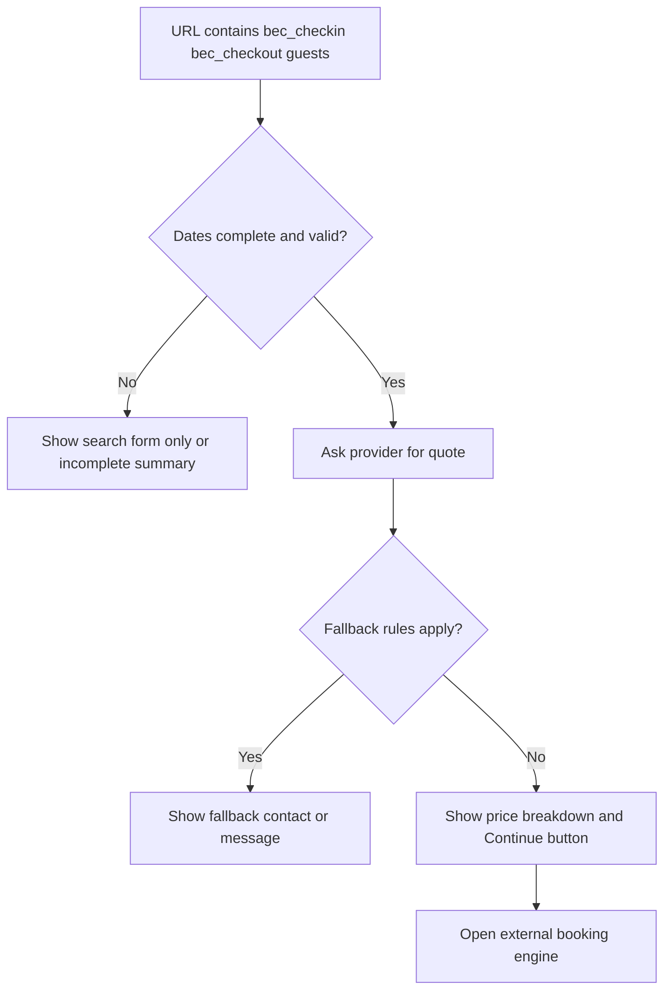

# How it works

This page is the **mental model** for the whole plugin: where data lives, how it moves, and what visitors experience.

{/* SCREENSHOT: Simple annotated diagram exported from design tool — optional alternative to Mermaid below */}

{/* Intended screenshot (add file at `docs/img/01-introduction/flow-overview.png`): flow-overview.png */}

---

## End-to-end flow

1. **Sync** pulls inventory from the **provider API** and creates or updates **Units** in WordPress.
2. **Shortcodes** render search UI, dates, prices, and booking widgets on your pages.
3. When dates are complete in the URL, the plugin requests a **quote** from the API (with short-term caching).
4. **Checkout** sends the visitor to the provider’s **booking website** (`Engine`) with the right stay parameters—not WordPress checkout.

---

## Single unit page (typical)

Auto-appended booking UI on singular units follows similar logic; you can also place shortcodes manually.

---

## Related pages

- **[Search context and URLs](../05-bookings-and-checkout/01-search-context-and-urls.md)** — Exact URL parameters.
- **[Architecture (developers)](../09-developer-reference/01-architecture.md)** — Module-level diagrams.
