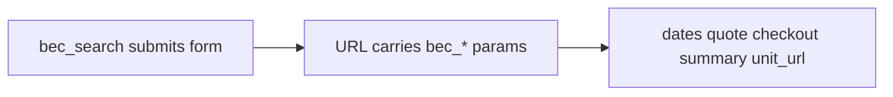

# Shortcodes overview

Shortcodes are WordPress shortcuts you place in pages, patterns, or templates. Booking Engine Connector registers the following:

| Shortcode | Purpose |
|-----------|---------|
| `[bec_search]` | Availability search (GET). Seeds **`bec_*`** URL parameters on the form **`action`**—by default the **units archive** (or use **`redirect_url`** for another page). |
| `[bec_dates]` | Human-readable summary of stay dates from the URL. |
| `[bec_quote]` | Compact availability / price line (optional rate list). |
| `[bec_checkout]` | External checkout button or POST form. |
| `[bec_booking_summary]` | Full booking sidebar/card with search, breakdown, mobile drawer. |
| `[bec_unit_url]` | Outputs **only** the URL string (for `href`) keeping search params. |
| `[bec_unit_info]` | Provider-specific HTML blocks (e.g. amenities grid). |
| `[bec_unit_field]` | Single scalar from synced provider payload (dot path, e.g. CIN). |
| `[bec_unit_gallery]` | JSON gallery from canonical attachment IDs (for custom JS). |
| `[bec_fallback]` | Admin-configured fallback link or rich content. |
| `[bec_version]` | Prints plugin version (support/debug). |

---

## One URL ties everything together

Shortcodes **do not** pass hidden state between each other—they **read the same query string**. Always ensure your navigation links preserve parameters (`[bec_unit_url]` helps).

---

## The `unit_id` attribute pattern

Several shortcodes accept **`unit_id`**:

| Value | Behaviour |
|-------|-----------|
| **Omitted or `0`** | Uses the **current post** in the WordPress loop—ideal on singular unit templates. |
| **Positive number** | Targets that specific **Units** post ID (archive cards, reusable blocks). |

If `unit_id` points at something that is **not** a unit, output is typically empty.

---

## Elementor (optional)

| Feature | When to use |
|---------|-------------|
| **Loop Grid — Query ID `bec_available_only`** | Hide archive cards with no availability when the URL has complete search params. See **[Elementor — hide units with no availability](./11-elementor-loop-grid-availability-filter.md)**. |
| **Dynamic tag — Unit gallery** | Fill Gallery / Media Carousel widgets from **`bec_core_gallery`**. See **[Elementor — Unit gallery](./14-elementor-unit-gallery.md)**. |

---

## Screenshots per shortcode

Each dedicated page below lists **CSS hooks** you can style safely with **Booking Engine → Styling → Extra CSS** or your theme stylesheet.

{/* SCREENSHOT: Collage or grid of multiple shortcodes on sample pages */}

{/* Intended screenshot (add file at `docs/img/06-shortcodes/shortcodes-collage.png`): shortcodes-collage.png */}

---

## Jump in

- **[bec_search](./02-bec-search.md)**
- **[bec_booking_summary](./06-bec-booking-summary.md)** — longest guide
- **[bec_unit_field](./12-bec-unit-field.md)** · **[bec_unit_gallery](./13-bec-unit-gallery.md)**
- **[Elementor Loop Grid availability filter](./11-elementor-loop-grid-availability-filter.md)** · **[Elementor Unit gallery](./14-elementor-unit-gallery.md)**
