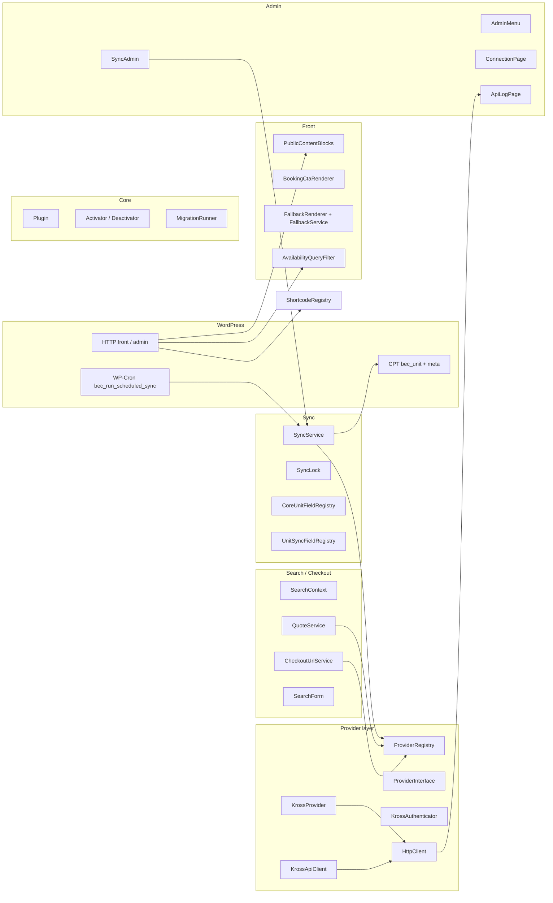
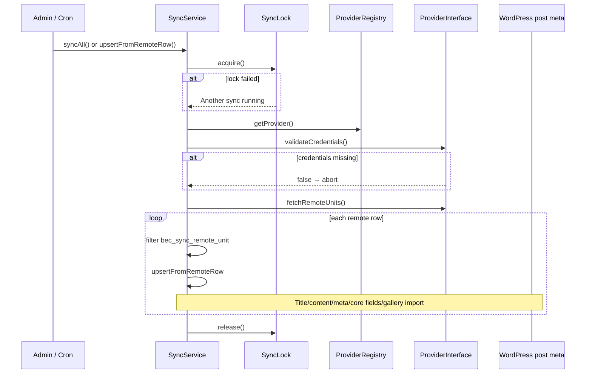
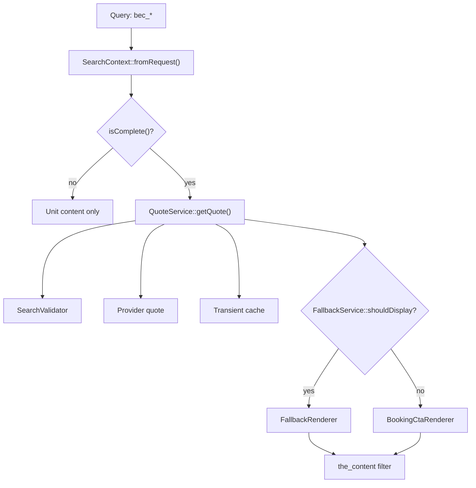
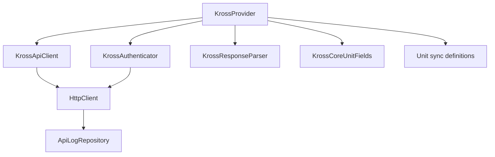
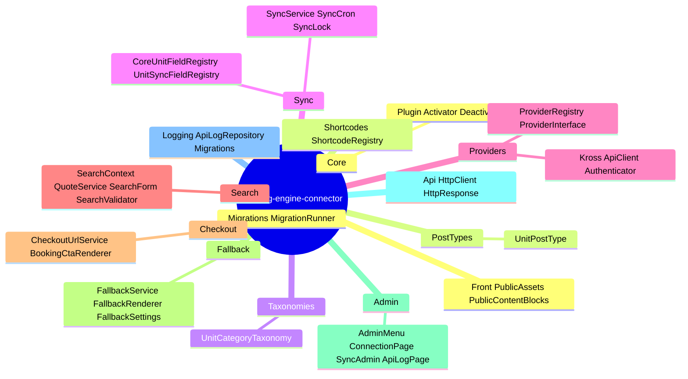

# Architecture

> **Developer reference:** This section is for theme and plugin developers extending Booking Engine Connector.

Reference diagrams use [Mermaid](https://mermaid.js.org/). PHP namespaces live under `BookingEngineConnector\`.

---

## Overview

The plugin:

1. Loads the PSR-4 autoloader (`includes/`), defines `BEC_*` constants, runs `bootstrap.php` (database migrations), then `Plugin::instance()->init()`.
2. **On activation:** incremental migrations, default options (sync interval, fallback/checkout defaults), schedules WP-Cron.
3. **On `plugins_loaded`:** template helpers, text domain, registration of search/front/admin/sync/CPT/field registries/shortcodes/Elementor query hook.

---

## Elementor Pro (Loop Grid)

`BookingEngineConnector\Elementor\AvailabilityQueryFilter` registers Elementor’s action `elementor/query/{query_id}` (default query id **`bec_available_only`**, overridable via **`bec_elementor_availability_query_id`**). It narrows the Loop Grid using **`QuoteService::getQuote()`** and the current **`SearchContext`**.

**Developer filters:** `bec_elementor_availability_query_id`, `bec_elementor_available_post_ids`, `bec_elementor_availability_max_units`.

User-facing setup: **[Elementor — hide units with no availability](../06-shortcodes/11-elementor-loop-grid-availability-filter.md)**.

---

## Bootstrap & module registration

```mermaid
flowchart TB
  subgraph entry [Main plugin file]
    BEC["booking-engine-connector.php"]
    BEC --> Autoload["Autoload::register()"]
    BEC --> Boot["includes/bootstrap.php"]
    Boot --> MigReg["MigrationRunner registers migrations"]
    BEC --> PI["Plugin::instance()->init()"]
  end

  subgraph plugin_init [Plugin::init()]
    PI --> Hooks["activation / deactivation hooks"]
    PI --> PL["add_action('plugins_loaded', onPluginsLoaded)"]
  end

  subgraph loaded [onPluginsLoaded]
    PL --> TplFn["template-functions.php"]
    PL --> I18n["load_plugin_textdomain"]
    PL --> Mod["Register modules"]
  end

  subgraph modules [Registered modules]
    STH["SearchTemplateHooks"]
    PA["PublicAssets"]
    PCB["PublicContentBlocks"]
    AM["AdminMenu + ConnectionPage + StylingPage + FallbackPage"]
    SC["SyncCron"]
    SA["SyncAdmin"]
    UPT["UnitPostType"]
    UCAT["UnitCategoryTaxonomy"]
    CUF["CoreUnitFieldRegistry"]
    USF["UnitSyncFieldRegistry"]
    SH["ShortcodeRegistry"]
    AQF["AvailabilityQueryFilter (Elementor)"]
  end

  Mod --> modules
```

---

## Layered architecture



---

## Sync sequence



---

## Front flow — query string → quote → CTA or fallback

URL parameters include `bec_checkin`, `bec_checkout`, optional occupancy keys (`See SearchContext`).



Shortcodes reuse the same services (`SearchForm`, `CheckoutUrlService`, `QuoteService`, etc.).

---

## REST API, blocks, and webhooks

- **No custom public REST API** is registered for booking operations (`register_rest_route` is unused for BEC’s own endpoints). The **`bec_unit`** CPT participates in WordPress core post REST where configured; sensitive meta such as **`bec_sync_payload`** is withheld from REST.
- **No Gutenberg blocks** ship with the plugin PHP (`register_block_type` is not used) — use **shortcodes** or theme integration.
- **No inbound webhooks** — inventory is **pulled** on sync (WP-Cron + admin actions) and quotes are requested on demand.

Admin-only integration points include **`wp_ajax_*`** handlers (sync progress + batched steps) and **`admin_post_*`** actions documented for developers in **[Sync hooks & filters](./02-sync-hooks-and-filters.md)**.

---

## Kross provider internals



---

## Directory mind map



---

## Concept map

| Area | Responsibility |
|------|----------------|
| Remote inventory | `ProviderInterface::fetchRemoteUnits()` |
| Persisted posts/meta | `SyncService` + canonical core fields + optional mapped meta |
| Booking context | `SearchContext` built from `bec_*` query args |
| Extensibility | Filters/actions prefixed `bec_*` |

---

## Related developer docs

- **[Sync hooks & filters](./02-sync-hooks-and-filters.md)**
- **[Post meta reference](./03-post-meta-reference.md)**
- **[Canonical unit fields](./04-canonical-unit-fields.md)**
- **[Kross API](./05-kross-api.md)**
