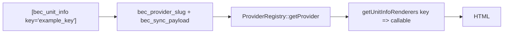

# Provider-specific unit shortcodes (`[bec_unit_info]`)

> **Developer reference:** This section is for theme and plugin developers.

The plugin exposes **one** public shortcode for provider-specific data tied to a synced unit: **`[bec_unit_info]`**. There is no per-provider shortcode name (e.g. no `[bec_kross_…]` in core). Instead, each **provider** registers a map of string **keys** to **renderer callables**; the shortcode picks a key and the active **unit’s** provider implementation supplies the renderers.

This keeps theme and page content stable (`key="…"`) while each engine can read its own `bec_sync_payload` shape (especially the nested `raw` object from the remote API).

End-user oriented examples live under **[bec_unit_info](../06-shortcodes/08-bec-unit-info.md)**.

---

## How it works (high level)

1. The shortcode runs in the context of a `bec_unit` post (the current post in the loop, or `unit_id="123"`).
2. The plugin reads **`bec_provider_slug`** on that post and resolves the matching provider class via `ProviderRegistry`.
3. It loads **`getUnitInfoRenderers()`** on that provider — a `key => callable` array.
4. It decodes post meta **`bec_sync_payload`** (JSON) into a PHP array (the same normalised row stored at sync time, with `raw` for provider-native fields).
5. It calls the renderer for the requested `key` and returns the **HTML string** (unchanged: renderers and filters own escaping; see [Security](#security)).



---

## Shortcode attributes

| Attribute | Default | Description |
|-----------|---------|-------------|
| `key` | `''` | Renderer key; required for non-empty output (after trimming). |
| `unit_id` | `0` | WordPress post ID of the unit. `0` means the current post (`get_the_ID()`). |
| `default` | `''` | Shown (HTML-escaped) when the key is missing, the post is not a unit, the payload is empty/invalid, or the renderer throws. |
| *any other* | — | Passed through to the renderer (e.g. `format="short"`). See [Custom attributes](#custom-attributes). |

**Examples**

```text
[bec_unit_info key="rooms_beds"]
```

```text
[bec_unit_info key="rooms_beds" unit_id="456" default="—"]
```

---

## Renderer contract

`ProviderInterface::getUnitInfoRenderers()` must return:

```php
/**
 * @return array<string, callable>
 */
public function getUnitInfoRenderers(): array;
```

Each **callable** is invoked as:

```php
$html = $callback(
    array $syncPayload,  // Decoded `bec_sync_payload`
    int $postId,           // `bec_unit` post ID
    array $passThrough,    // Shortcode attributes minus key, unit_id, default
    array $context         // e.g. ['provider' => 'kross', 'locale' => 'en']
);
```

- **`$syncPayload`**: The normalised sync row. For Kross this includes `raw` with the full `get-room-types` object for that room type; use that for engine-specific structure (room composition, bed types, custom fields, etc.). Canonical `bec_core_*` may duplicate some of this, but the payload is the source of truth for “what the API sent.”
- **`$context['locale']`**: A two-letter language code derived from the site locale, for picking translated strings in `raw` if needed.

Return a **string** of HTML. Non-string return values are treated as empty.

---

## Global WordPress filters

### `bec_unit_info_renderers`

Fires after the provider’s map is built, before dispatch.

```
apply_filters( 'bec_unit_info_renderers', array $renderers, string $provider_slug, string $key, int $post_id );
```

- Add or override keys for a given post or provider.
- Receives the **current** key so you can branch (e.g. only alter one key).

### `bec_unit_info_output`

Fires after a successful render, before the shortcode output is returned.

```
apply_filters( 'bec_unit_info_output', string $html, string $key, int $post_id, array $sync_payload, array $context );
```

- Wrap or tweak HTML site-wide, or for one `key` / `post_id`.

---

## Kross: where to register keys

1. **In code (recommended for bundled keys)** — Edit `includes/Providers/Kross/KrossUnitInfoRenderers.php` and add entries to the `$renderers` array, pointing to static methods on that class (or to small dedicated classes).

2. **Extension via filter** — The same file runs:

   ```
   apply_filters( 'bec_kross_unit_info_renderers', $renderers );
   ```

   Use this from a custom plugin or `functions.php` to register keys without editing core plugin files.

---

## Kross: amenities grid (`amenities_grid`)

Kross registers the built-in key **`amenities_grid`**: a simple grid of **icon + label** for each normalised amenity. Icons use the **amenities icon font** with classes in the form `icon-{amenity_key}` (e.g. `icon-air_conditioning`), where `amenity_key` is the Kross `cod_amenity` (sanitised) stored as `key` in `bec_core_amenities`.

**Usage**

```text
[bec_unit_info key="amenities_grid"]
[bec_unit_info key="amenities_grid" unit_id="123" columns="3" font_pack="font-1" limit="12" category="amenity"]
```

| Pass-through | Default | Description |
|--------------|---------|-------------|
| `font_pack` | `font-1` | Slug of an entry registered via `bec_amenities_font_packs` (icon CSS is expected under `assets/fonts/amenities/{slug}/style.css`). |
| `columns` | `2` | Number of grid columns, **1–6** (applies the CSS custom property `--bec-amenities-cols` on the root). |
| `columns_mobile` | `1` | Grid columns below **640px**, **1–6** (applies `--bec-amenities-cols-mobile`). |
| `limit` | all | Maximum number of items after **natural sort by label**; `0` means no limit. |
| `category` | *(open)* | If set, only items whose normalised `category` matches (e.g. `amenity`). `mandatory_service` is not shown in this grid. |

**Data source (order)**

1. Post meta **`bec_core_amenities`** when non-empty (same structure as at sync: `key`, `labels`, optional `category`, etc.).
2. Otherwise **rebuild** from the current **`bec_sync_payload`** using `KrossAmenitiesExtractor` (equivalent to what sync would produce for `raw`).

**Labels / locale** — each item’s `labels` map is chosen using `$context['locale']` (two-letter code from the shortcode), with fallback to `en` then the first available label. If the label is still empty, the renderer falls back to the amenity `key` string (escaped for display only via `esc_html` on the final text).

**Assets**

- Grid layout: `assets/public-amenities-kross.css` (style handle `bec-amenities-kross-grid`).
- Icon pack: the selected pack’s `style.css` (default `assets/fonts/amenities/font-1/style.css`) registered/enqueued in `includes/Front/AmenitiesAssets.php`.

`AmenitiesAssets` **preloads** the font + grid on: singular `bec_unit` pages, the unit post type archive, or singular post/page content that contains a `[bec_unit_info … key="amenities_grid" …]` shortcode. The renderer also **enqueues** when the shortcode runs, so the grid can load on templates that were not pre-detected.

**Filters (extend without editing core)**

| Filter | Purpose |
|--------|---------|
| `bec_amenities_font_packs` | Map `slug` → `rel_path` + `handle` for each icon pack (`handle` must be unique). |
| `bec_kross_amenities_default_font_pack` | Default pack slug when `font_pack` is omitted. |
| `bec_enqueue_kross_amenities_assets` | Return `true` to force Kross stack enqueue for the current request (`$post` or `null`). |

---

## Kross: bedroom arrangements (`bedroom_arrangements`)

Kross registers **`bedroom_arrangements`**: a grid of per-bedroom headings and a list of **count × label** bed lines (icons use the same amenities font classes as the amenities grid, e.g. `icon-queen_bed`).

**Usage**

```text
[bec_unit_info key="bedroom_arrangements"]
[bec_unit_info key="bedroom_arrangements" unit_id="123" columns="3" font_pack="font-1" title="Bed layout" show_title="1"]
```

| Pass-through | Default | Description |
|--------------|---------|-------------|
| `font_pack` | `font-1` | Slug of an entry registered via `bec_amenities_font_packs` (icon CSS is under `assets/fonts/amenities/{slug}/style.css`). |
| `columns` | `3` | Number of grid columns, **1–6** (applies the CSS custom property `--bec-bedrooms-cols` on the root). |
| `title` | *(empty)* | If non-empty, replaces the default translatable section title (“Sleeping arrangements”). For multilingual sites, prefer leaving this empty so WordPress can translate the default string, or use a theme/mu-plugin filter on `bec_unit_info_output` / per-locale page content. |
| `show_title` | *(hidden)* | Set to `1`, `yes`, or `true` to show the section title; hidden by default. |

**Data source**

- Post meta **`bec_sync_payload`** → `raw.bedroom_details` (Kross `get-room-types` with `with_bed_bath_details`).

Each item has a `type` (e.g. `BEDROOM`) and a `beds` object: keys are Kross bed codes (`double_bed`, `single_bed`, …) and values are counts.

**Labels / locale (translation strategy)**

1. If `raw.amenities` includes an amenity whose `cod_amenity` matches the bed key (or a small alias, e.g. `double_bed` ↔ `double_beds` / `queen_bed`), the label is taken from `name_amenity_translations` using the shortcode’s `$context['locale']` (with `en` and first-available fallbacks) — same idea as the amenities grid.
2. Otherwise, known keys use bundled gettext strings in the `booking-engine-connector` text domain.
3. Otherwise, the key is “humanized” for display.
4. Finally, the filter `bec_kross_bedroom_label` can replace the final label.

Bed keys are mapped to icon font suffixes (e.g. `double_bed` → `queen_bed`) using `bec_kross_bedroom_bed_map` (defaults in code) so the icon grid stays aligned with the amenities font.

**Assets**

- Layout: `assets/public-bedrooms-kross.css` (handle `bec-bedrooms-kross`, depends on the selected font pack).
- Font pack: same as `amenities_grid` via `includes/Front/AmenitiesAssets.php`.

**Extra filters (bedroom-specific)**

| Filter | Purpose |
|--------|---------|
| `bec_kross_bedroom_bed_map` | Map `string $bedKey => string $iconKey` (icon suffix for `icon-{iconKey}`) before render. |
| `bec_kross_bedroom_label` | Filter the final bed line label: `( string $label, string $bedKey, string $iconKey, int $postId, array $syncPayload, array $context )`. |

---

## Example: register a key from the theme (filter only)

```php
add_filter( 'bec_kross_unit_info_renderers', function ( array $renderers ) {
    $renderers['my_custom_key'] = function ( $syncPayload, $postId, $atts, $context ) {
        $raw = $syncPayload['raw'] ?? [];
        if ( ! is_array( $raw ) ) {
            return '';
        }
        return '<p class="bec-unit-info bec-unit-info--custom">' . esc_html( (string) ( $raw['some_field'] ?? '' ) ) . '</p>';
    };
    return $renderers;
}, 10, 1 );
```

Page content:

```text
[bec_unit_info key="my_custom_key"]
```

---

## Custom attributes

Attributes other than `key`, `unit_id`, and `default` are passed in `$passThrough` so you can offer variants without new keys.

```text
[bec_unit_info key="rooms_beds" format="short"]
```

In the renderer, read `$atts['format']` (after checking it is allowed).

---

## New provider (not Kross)

When you add a second engine:

1. Implement `ProviderInterface` (including `getUnitInfoRenderers()` — can return `[]` if unsupported initially).
2. Return your own `key => callable` map (often `OtherEngineUnitInfoRenderers`).
3. Wire registration via **`bec_registered_providers`** + **`bec_provider_instance`** (see **[Adding a provider](./06-adding-a-provider.md)**) and ensure sync writes correct **`bec_provider_slug`** values.

The shortcode always uses the **unit post’s** `bec_provider_slug`, not only the site-wide “active” provider.

---

## Security

- The shortcode does **not** auto-escape renderer output. Treat renderers as responsible for **escaping** text (`esc_html`, `esc_attr`) and for **markup** safety (`wp_kses` with an allowed set if the API returns HTML).
- The `default` attribute is passed through `esc_html` on fallback paths.
- If the renderer **throws** any `Throwable`, the shortcode shows `default` and does not surface the exception to visitors.

---

## Troubleshooting

| Symptom | Things to check |
|---------|------------------|
| Always shows `default` or empty | `key` misspelled; no renderer for that `key`; `bec_sync_payload` empty; JSON invalid; not a `bec_unit` or wrong `unit_id`. |
| Wrong provider’s renderers | `bec_provider_slug` on the post; `ProviderRegistry::getProvider( $slug )` resolves to your class. |
| Data missing in payload | Use `raw` from API; re-sync the unit; confirm `fetchRemoteUnits` / filters still fill `raw` in the stored row. |

---

## Related

- **[Sync hooks & filters](./02-sync-hooks-and-filters.md)** — `bec_sync_payload`
- **[Post meta reference](./03-post-meta-reference.md)**
- **[Kross API](./05-kross-api.md)**
