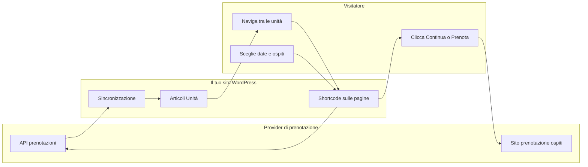
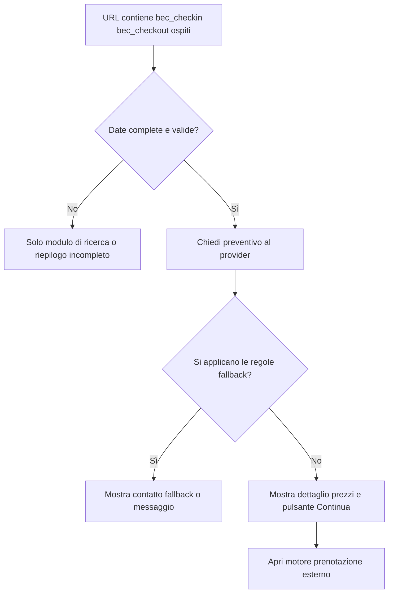

# Come funziona

Questa pagina è il **modello concettuale** dell’intero plugin: dove risiedono i dati, come si muovono e cosa percepiscono i visitatori.

{/* SCREENSHOT: Simple annotated diagram exported from design tool — optional alternative to Mermaid below */}

{/* Intended screenshot (add file at `docs/img/01-introduction/flow-overview.png`): flow-overview.png */}

---

## Flusso end-to-end

1. La **sincronizzazione** scarica l’inventario dall’**API del provider** e crea o aggiorna le **Unità** in WordPress.
2. Gli **shortcode** mostrano UI di ricerca, date, prezzi e widget di prenotazione sulle tue pagine.
3. Quando le date sono complete nell’URL, il plugin richiede un **preventivo** all’API (con cache di breve durata).
4. Il **checkout** invia il visitatore sul **sito di prenotazione** del provider (`Engine`) con i parametri di soggiorno corretti — non il checkout WordPress.

---

## Pagina singola unità (tipica)

L’UI di prenotazione aggiunta automaticamente sulle singole unità segue logica simile; puoi anche posizionare gli shortcode manualmente.

---

## Pagine correlate

- **[Contesto di ricerca e URL](../05-bookings-and-checkout/01-search-context-and-urls.md)** — Parametri URL esatti.
- **[Architettura (sviluppatori)](../09-developer-reference/01-architecture.md)** — Diagrammi a livello di modulo.
