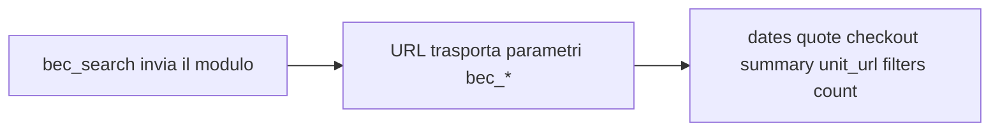

# Panoramica shortcode

Gli shortcode sono scorciatoie WordPress che inserisci in pagine, pattern o template. Booking Engine Connector registra i seguenti:

| Shortcode | Scopo |
|-----------|--------|
| `[bec_search]` | Modulo ricerca (GET). Imposta i parametri URL **`bec_*`** sul **`action`** del form — predefinito **archivio unità** (oppure **`redirect_url`** per un’altra pagina). |
| `[bec_dates]` | Riepilogo date di soggiorno leggibile dall’URL. |
| `[bec_quote]` | Riga compatta disponibilità / prezzo (elenco tariffe opzionale). |
| `[bec_checkout]` | Pulsante checkout esterno o modulo POST. |
| `[bec_booking_summary]` | Riquadro/card prenotazione completo con ricerca, dettaglio, drawer mobile. |
| `[bec_unit_url]` | Produce **solo** la stringa URL (per `href`) mantenendo i parametri di ricerca. |
| `[bec_unit_info]` | Blocchi HTML specifici del provider (es. griglia servizi). |
| `[bec_unit_field]` | Valore scalare dal payload provider sincronizzato (percorso puntato, es. CIN). |
| `[bec_unit_gallery]` | Gallery JSON da ID allegati canonici (per JS personalizzato). |
| `[bec_unit_filters]` | Filtri elenco unità (ordine, camere, bagni, servizi) via GET. |
| `[bec_available_units_count]` | Conteggio unità che corrispondono a filtri e disponibilità. |
| `[bec_fallback]` | Link o contenuto arricchito fallback configurato in admin. |
| `[bec_version]` | Stampa versione plugin (supporto/debug). |

---

## Un URL aggancia tutto

Gli shortcode **non** passano stato nascosto tra loro — **leggono la stessa query string**. Assicurati che i link di navigazione preservino i parametri (aiuta **`[bec_unit_url]`**).

---

## Modello attributo `unit_id`

Diversi shortcode accettano **`unit_id`**:

| Valore | Comportamento |
|--------|----------------|
| **Omesso o `0`** | Usa il **post corrente** nel loop WordPress — ideale su template singola unità. |
| **Numero positivo** | Punta a quell’ID post **Units** (schede archivio, blocchi riutilizzabili). |

Se `unit_id` non punta a un’unità, l’output è di solito vuoto.

---

## Elementor (opzionale)

| Funzione | Quando usarla |
|----------|----------------|
| **Loop Grid — Query ID `bec_available_only`** o **`bec_filtered_units`** | Nascondere schede archivio senza disponibilità quando l’URL ha parametri di ricerca completi; applica filtri unità. Vedi **[Elementor — nascondere unità senza disponibilità](./11-elementor-loop-grid-availability-filter.md)**. |
| **Dynamic tag — Unit gallery** | Alimentare widget Gallery / Media Carousel da **`bec_core_gallery`**. Vedi **[Elementor — Unit gallery](./14-elementor-unit-gallery.md)**. |

Abbina **`[bec_unit_filters]`** e **`[bec_available_units_count]`** sopra elenchi Loop Grid sulle pagine risultati ricerca.

---

## Screenshot per shortcode

Ogni pagina dedicata elenca **hook CSS** che puoi stilizzare in sicurezza con **Booking Engine → Design → Extra CSS** o il foglio del tema.

{/* SCREENSHOT: Collage or grid of multiple shortcodes on sample pages */}

{/* Intended screenshot (add file at `docs/img/06-shortcodes/shortcodes-collage.png`): shortcodes-collage.png */}

---

## Inizia da qui

- **[bec_search](./02-bec-search.md)**
- **[bec_booking_summary](./06-bec-booking-summary.md)** — guida più lunga
- **[bec_unit_filters](./15-bec-unit-filters.md)** · **[bec_available_units_count](./16-bec-available-units-count.md)**
- **[bec_unit_field](./12-bec-unit-field.md)** · **[bec_unit_gallery](./13-bec-unit-gallery.md)**
- **[Filtro disponibilità Elementor Loop Grid](./11-elementor-loop-grid-availability-filter.md)** · **[Elementor Unit gallery](./14-elementor-unit-gallery.md)**
