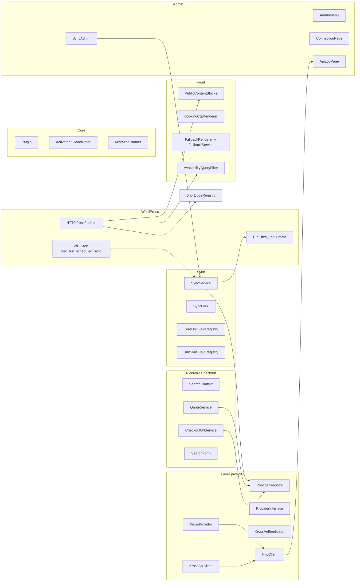
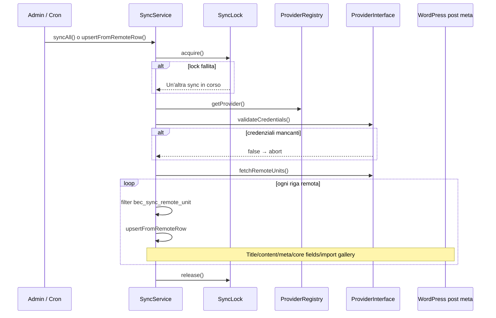
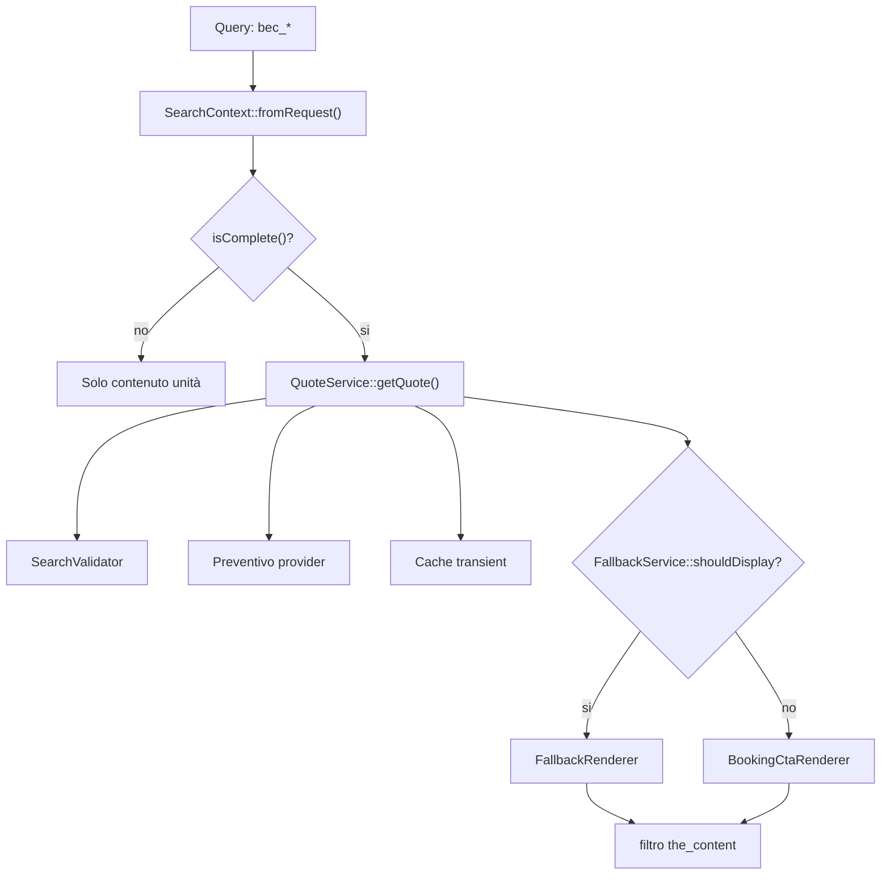
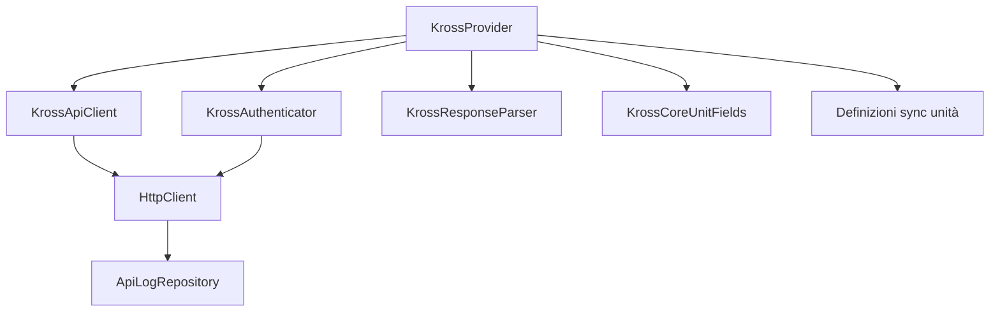
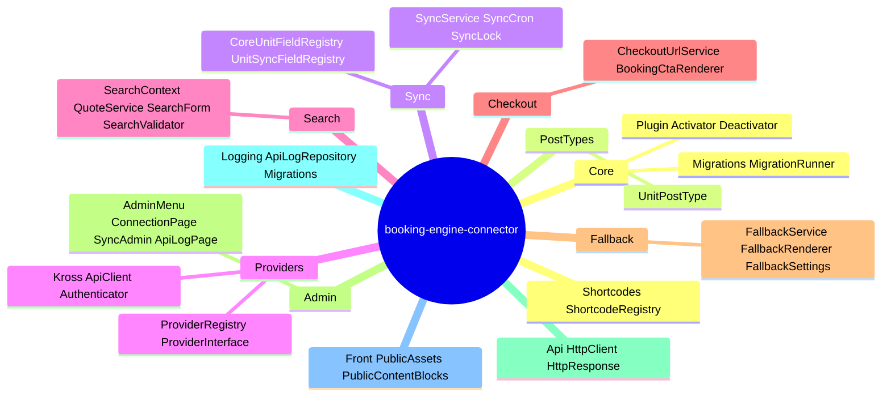

# Architettura

> **Riferimento sviluppatori:** questa sezione è per chi estende Booking Engine Connector con temi o plugin.

I diagrammi di riferimento usano [Mermaid](https://mermaid.js.org/). I namespace PHP sono sotto `BookingEngineConnector\`.

---

## Panoramica

Il plugin:

1. Carica l’autoloader PSR-4 (`includes/`), definisce costanti `BEC_*`, esegue `bootstrap.php` (migrazioni database), poi `Plugin::instance()->init()`.
2. **All’attivazione:** migrazioni incrementali, opzioni predefinite (intervallo sync, default checkout/fallback), pianifica WP-Cron.
3. **Su `plugins_loaded`:** helper template, text domain, registrazione ricerca/front/admin/sync/CPT/registry campi/shortcode/hook query Elementor.

---

## Elementor Pro (Loop Grid)

`BookingEngineConnector\Elementor\AvailabilityQueryFilter` registra l’azione Elementor `elementor/query/{query_id}` (query id predefinita **`bec_available_only`**, sovrascrivibile con **`bec_elementor_availability_query_id`**). Restringe il Loop Grid usando **`QuoteService::getQuote()`** e il **`SearchContext`** corrente.

**Filtri sviluppatore:** `bec_elementor_availability_query_id`, `bec_elementor_available_post_ids`, `bec_elementor_availability_max_units`.

Guida utente: **[Elementor — nascondere unità senza disponibilità](../06-shortcodes/11-elementor-loop-grid-availability-filter.md)**.

---

## Bootstrap e registrazione moduli

```mermaid
flowchart TB
  subgraph entry [File principale plugin]
    BEC["booking-engine-connector.php"]
    BEC --> Autoload["Autoload::register()"]
    BEC --> Boot["includes/bootstrap.php"]
    Boot --> MigReg["MigrationRunner registra migrazioni"]
    BEC --> PI["Plugin::instance()->init()"]
  end

  subgraph plugin_init [Plugin::init()]
    PI --> Hooks["hook attivazione / disattivazione"]
    PI --> PL["add_action('plugins_loaded', onPluginsLoaded)"]
  end

  subgraph loaded [onPluginsLoaded]
    PL --> TplFn["template-functions.php"]
    PL --> I18n["load_plugin_textdomain"]
    PL --> Mod["Registra moduli"]
  end

  subgraph modules [Moduli registrati]
    STH["SearchTemplateHooks"]
    PA["PublicAssets"]
    PCB["PublicContentBlocks"]
    AM["AdminMenu + ConnectionPage + StylingPage + FallbackPage"]
    SC["SyncCron"]
    SA["SyncAdmin"]
    UPT["UnitPostType"]
    CUF["CoreUnitFieldRegistry"]
    USF["UnitSyncFieldRegistry"]
    SH["ShortcodeRegistry"]
    AQF["AvailabilityQueryFilter (Elementor)"]
  end

  Mod --> modules
```

---

## Architettura a strati



---

## Sequenza sync



---

## Flusso front — query string → preventivo → CTA o fallback

I parametri URL includono `bec_checkin`, `bec_checkout`, chiavi occupazione opzionali (vedi `SearchContext`).



Gli shortcode riusano gli stessi servizi (`SearchForm`, `CheckoutUrlService`, `QuoteService`, ecc.).

---

## Internals provider Kross



---

## Mappa directory



---

## Mappa concettuale

| Area | Responsabilità |
|------|----------------|
| Inventario remoto | `ProviderInterface::fetchRemoteUnits()` |
| Post/meta persistiti | `SyncService` + campi core canonici + meta mappati opzionali |
| Contesto prenotazione | `SearchContext` costruito dagli argomenti query `bec_*` |
| Estensibilità | Filtri/azioni con prefisso `bec_*` |

---

## Documentazione sviluppatori correlata

- **[Hook e filtri sync](./02-sync-hooks-and-filters.md)**
- **[Riferimento post meta](./03-post-meta-reference.md)**
- **[Campi canonici unità](./04-canonical-unit-fields.md)**
- **[API Kross](./05-kross-api.md)**
