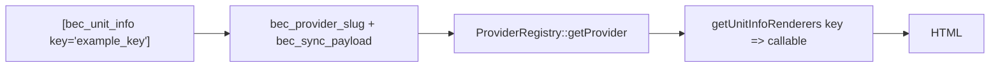

# Shortcode unità specifici del provider (`[bec_unit_info]`)

> **Riferimento sviluppatori:** per sviluppatori di temi e plugin.

Il plugin espone **un** shortcode pubblico per dati specifici del provider legati a un’unità sincronizzata: **`[bec_unit_info]`**. Non esiste uno shortcode per provider nel core (es. nessun `[bec_kross_…]`). Ogni **provider** registra invece una mappa di **chiavi** stringa verso **callable** renderer; lo shortcode sceglie una chiave e l’implementazione provider dell’**unità attiva** fornisce i renderer.

Così tema e contenuto delle pagine restano stabili (`key="…"`) mentre ogni motore può leggere la propria forma di `bec_sync_payload` (in particolare l’oggetto annidato `raw` dall’API remota).

Esempi orientati all’utente sono in **[bec_unit_info](../06-shortcodes/08-bec-unit-info.md)**.

---

## Come funziona (alto livello)

1. Lo shortcode gira nel contesto di un post `bec_unit` (post corrente nel loop, oppure `unit_id="123"`).
2. Il plugin legge **`bec_provider_slug`** su quel post e risolve la classe provider tramite `ProviderRegistry`.
3. Carica **`getUnitInfoRenderers()`** su quel provider — array `key => callable`.
4. Decodifica il meta **`bec_sync_payload`** (JSON) in array PHP (la stessa riga normalizzata salvata alla sync, con `raw` per campi nativi del provider).
5. Chiama il renderer per la `key` richiesta e restituisce la **stringa HTML** (invariata: escaping di renderer e filtri; vedi [Sicurezza](#sicurezza)).



---

## Attributi shortcode

| Attributo | Predefinito | Descrizione |
|-----------|-------------|-------------|
| `key` | `''` | Chiave renderer; obbligatoria per output non vuoto (dopo trim). |
| `unit_id` | `0` | ID post WordPress dell’unità. `0` = post corrente (`get_the_ID()`). |
| `default` | `''` | Mostrato (escapato HTML) se manca la chiave, il post non è un’unità, payload vuoto/non valido, o il renderer lancia eccezione. |
| *qualsiasi altro* | — | Passato al renderer (es. `format="short"`). Vedi [Attributi personalizzati](#attributi-personalizzati). |

**Esempi**

```text
[bec_unit_info key="rooms_beds"]
```

```text
[bec_unit_info key="rooms_beds" unit_id="456" default="—"]
```

---

## Contratto renderer

`ProviderInterface::getUnitInfoRenderers()` deve restituire:

```php
/**
 * @return array<string, callable>
 */
public function getUnitInfoRenderers(): array;
```

Ogni **callable** è invocato come:

```php
$html = $callback(
    array $syncPayload,  // `bec_sync_payload` decodificato
    int $postId,           // ID post `bec_unit`
    array $passThrough,    // Attributi shortcode meno key, unit_id, default
    array $context         // es. ['provider' => 'kross', 'locale' => 'en']
);
```

- **`$syncPayload`**: Riga sync normalizzata. Per Kross include `raw` con l’oggetto `get-room-types` completo per quel tipo stanza; usalo per struttura specifica del motore (composizione stanze, tipi letto, campi personalizzati, ecc.). I `bec_core_*` canonici possono duplicare parte di questo, ma il payload è la fonte di verità per “cosa ha inviato l’API”.
- **`$context['locale']`**: Codice lingua due lettere dal locale del sito, per scegliere stringhe tradotte in `raw` se serve.

Restituisci una **stringa** HTML. Valori non stringa sono trattati come vuoti.

---

## Filtri WordPress globali

### `bec_unit_info_renderers`

Scatta dopo che la mappa del provider è costruita, prima del dispatch.

```
apply_filters( 'bec_unit_info_renderers', array $renderers, string $provider_slug, string $key, int $post_id );
```

- Aggiungi o sovrascrivi chiavi per un dato post o provider.
- Riceve la **key corrente** così puoi ramificare (es. alterare solo una chiave).

### `bec_unit_info_output`

Scatta dopo un render riuscito, prima che lo shortcode restituisca l’output.

```
apply_filters( 'bec_unit_info_output', string $html, string $key, int $post_id, array $sync_payload, array $context );
```

- Avvolgi o modifica HTML a livello sito, o per una `key` / `post_id`.

---

## Kross: dove registrare le chiavi

1. **Nel codice (consigliato per chiavi incluse)** — Modifica `includes/Providers/Kross/KrossUnitInfoRenderers.php` e aggiungi voci all’array `$renderers`, puntando a metodi statici di quella classe (o piccole classi dedicate).

2. **Estensione via filtro** — Lo stesso file esegue:

   ```
   apply_filters( 'bec_kross_unit_info_renderers', $renderers );
   ```

   Usalo da plugin custom o `functions.php` per registrare chiavi senza editare i file core del plugin.

---

## Kross: griglia servizi (`amenities_grid`)

Kross registra la chiave built-in **`amenities_grid`**: una griglia semplice **icona + etichetta** per ogni servizio normalizzato. Le icone usano il **font icone servizi** con classi `icon-{amenity_key}` (es. `icon-air_conditioning`), dove `amenity_key` è il `cod_amenity` Kross (sanificato) salvato come `key` in `bec_core_amenities`.

**Uso**

```text
[bec_unit_info key="amenities_grid"]
[bec_unit_info key="amenities_grid" unit_id="123" columns="3" font_pack="font-1" limit="12" category="amenity"]
```

| Pass-through | Predefinito | Descrizione |
|--------------|-------------|-------------|
| `font_pack` | `font-1` | Slug di una voce registrata via `bec_amenities_font_packs` (il CSS icone è atteso in `assets/fonts/amenities/{slug}/style.css`). |
| `columns` | `2` | Numero colonne griglia, **1–6** (applica la custom property CSS `--bec-amenities-cols` sulla radice). |
| `limit` | all | Massimo elementi dopo **ordinamento naturale per etichetta**; `0` = nessun limite. |
| `category` | *(aperto)* | Se impostato, solo elementi la cui `category` normalizzata corrisponde (es. `amenity`). `mandatory_service` non è mostrato in questa griglia. |

**Fonte dati (ordine)**

1. Post meta **`bec_core_amenities`** se non vuota (stessa struttura della sync: `key`, `labels`, `category` opzionale, ecc.).
2. Altrimenti **ricostruzione** dal **`bec_sync_payload`** corrente con `KrossAmenitiesExtractor` (equivalente a quanto la sync produrrebbe per `raw`).

**Etichette / locale** — la mappa `labels` di ogni elemento è scelta con `$context['locale']` (codice due lettere dallo shortcode), con fallback a `en` poi prima etichetta disponibile. Se l’etichetta è ancora vuota, il renderer usa la stringa `key` del servizio (solo display escapata con `esc_html` sul testo finale).

**Asset**

- Layout griglia: `assets/public-amenities-kross.css` (handle `bec-amenities-kross-grid`).
- Icon pack: `style.css` del pack selezionato (default `assets/fonts/amenities/font-1/style.css`) registrato/enqueued in `includes/Front/AmenitiesAssets.php`.

`AmenitiesAssets` **precarica** font + griglia su: pagine singole `bec_unit`, archivio post type unità, o contenuto post/pagina singola che contiene uno shortcode `[bec_unit_info … key="amenities_grid" …]`. Il renderer **enqueue** anche quando lo shortcode gira, così la griglia può caricarsi su template non rilevati in anticipo.

**Filtri (estendi senza editare il core)**

| Filtro | Scopo |
|--------|--------|
| `bec_amenities_font_packs` | Mappa `slug` → `rel_path` + `handle` per ogni pack icone (`handle` unico). |
| `bec_kross_amenities_default_font_pack` | Slug pack default quando `font_pack` è omesso. |
| `bec_enqueue_kross_amenities_assets` | Restituisci `true` per forzare enqueue stack Kross per la richiesta corrente (`$post` o `null`). |

---

## Kross: disposizione camere (`bedroom_arrangements`)

Kross registra **`bedroom_arrangements`**: una griglia di intestazioni per camera e un elenco di righe letto **conteggio × etichetta** (stesse classi font servizi della griglia, es. `icon-queen_bed`).

**Uso**

```text
[bec_unit_info key="bedroom_arrangements"]
[bec_unit_info key="bedroom_arrangements" unit_id="123" columns="3" font_pack="font-1" title="Bed layout" show_title="1"]
```

| Pass-through | Predefinito | Descrizione |
|--------------|-------------|-------------|
| `font_pack` | `font-1` | Slug voce `bec_amenities_font_packs` (CSS in `assets/fonts/amenities/{slug}/style.css`). |
| `columns` | `3` | Colonne griglia **1–6** (custom property `--bec-bedrooms-cols` sulla radice). |
| `title` | *(vuoto)* | Se non vuoto, sostituisce il titolo sezione traducibile predefinito (“Sleeping arrangements”). Per siti multilingua, preferisci lasciare vuoto così WordPress traduce la stringa default, o usa filtro tema/mu-plugin su `bec_unit_info_output` / contenuto per locale. |
| `show_title` | `1` | Imposta `0`, `no` o `false` per nascondere il titolo sezione. |

**Fonte dati**

- Post meta **`bec_sync_payload`** → `raw.bedroom_details` (Kross `get-room-types` con `with_bed_bath_details`).

Ogni elemento ha un `type` (es. `BEDROOM`) e un oggetto `beds`: chiavi sono codici letto Kross (`double_bed`, `single_bed`, …) e valori sono conteggi.

**Etichette / locale (strategia traduzione)**

1. Se `raw.amenities` include un servizio il cui `cod_amenity` coincide con la chiave letto (o alias minimo, es. `double_bed` ↔ `double_beds` / `queen_bed`), l’etichetta viene da `name_amenity_translations` usando `$context['locale']` dello shortcode (con fallback `en` e prima disponibile) — stessa idea della griglia servizi.
2. Altrimenti chiavi note usano stringhe gettext nel text domain `booking-engine-connector`.
3. Altrimenti la chiave è “umanizzata” per il display.
4. Infine il filtro `bec_kross_bedroom_label` può sostituire l’etichetta finale.

Le chiavi letto sono mappate a suffissi font (es. `double_bed` → `queen_bed`) con `bec_kross_bedroom_bed_map` (default nel codice) così la griglia icone resta allineata al font servizi.

**Asset**

- Layout: `assets/public-bedrooms-kross.css` (handle `bec-bedrooms-kross`, dipende dal font pack selezionato).
- Font pack: come `amenities_grid` via `includes/Front/AmenitiesAssets.php`.

**Filtri extra (camera)**

| Filtro | Scopo |
|--------|--------|
| `bec_kross_bedroom_bed_map` | Mappa `string $bedKey => string $iconKey` (suffisso icona per `icon-{iconKey}`) prima del render. |
| `bec_kross_bedroom_label` | Filtra etichetta riga letto finale: `( string $label, string $bedKey, string $iconKey, int $postId, array $syncPayload, array $context )`. |

---

## Esempio: registrare una chiave dal tema (solo filtro)

```php
add_filter( 'bec_kross_unit_info_renderers', function ( array $renderers ) {
    $renderers['my_custom_key'] = function ( $syncPayload, $postId, $atts, $context ) {
        $raw = $syncPayload['raw'] ?? [];
        if ( ! is_array( $raw ) ) {
            return '';
        }
        return '<p class="bec-unit-info bec-unit-info--custom">' . esc_html( (string) ( $raw['some_field'] ?? '' ) ) . '</p>';
    };
    return $renderers;
}, 10, 1 );
```

Contenuto pagina:

```text
[bec_unit_info key="my_custom_key"]
```

---

## Attributi personalizzati

Attributi diversi da `key`, `unit_id` e `default` sono passati in `$passThrough` così puoi offrire varianti senza nuove chiavi.

```text
[bec_unit_info key="rooms_beds" format="short"]
```

Nel renderer leggi `$atts['format']` (dopo aver verificato che sia consentito).

---

## Nuovo provider (non Kross)

Quando aggiungi un secondo motore:

1. Implementa `ProviderInterface` (incluso `getUnitInfoRenderers()` — può restituire `[]` se non supportato inizialmente).
2. Restituisci la tua mappa `key => callable` (spesso `OtherEngineUnitInfoRenderers`).
3. Collega registrazione con **`bec_registered_providers`** + **`bec_provider_instance`** (vedi **[Aggiungere un provider](./06-adding-a-provider.md)**) e assicura che la sync scriva **`bec_provider_slug`** corretti.

Lo shortcode usa sempre il `bec_provider_slug` del **post unità**, non solo il provider “attivo” a livello sito.

---

## Sicurezza

- Lo shortcode **non** escapa automaticamente l’output dei renderer. I renderer sono responsabili di **escaping** testo (`esc_html`, `esc_attr`) e **sicurezza markup** (`wp_kses` con insieme consentito se l’API restituisce HTML).
- L’attributo `default` passa da `esc_html` nei percorsi di fallback.
- Se il renderer **lancia** un `Throwable`, lo shortcode mostra `default` e non espone l’eccezione ai visitatori.

---

## Risoluzione problemi

| Sintomo | Cosa verificare |
|---------|-----------------|
| Mostra sempre `default` o vuoto | `key` errata; nessun renderer per quella `key`; `bec_sync_payload` vuoto; JSON non valido; non è un `bec_unit` o `unit_id` sbagliato. |
| Renderer del provider sbagliato | `bec_provider_slug` sul post; `ProviderRegistry::getProvider( $slug )` risolve alla tua classe. |
| Dati mancanti nel payload | Usa `raw` dall’API; ri-sincronizza l’unità; conferma che `fetchRemoteUnits` / filtri popolino ancora `raw` nella riga memorizzata. |

---

## Correlati

- **[Hook e filtri sync](./02-sync-hooks-and-filters.md)** — `bec_sync_payload`
- **[Riferimento post meta](./03-post-meta-reference.md)**
- **[API Kross](./05-kross-api.md)**
